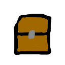

# Chest Loot Modifier



## About

Minecraft mod for modifying the items that appear in chests in Minecraft

Everytime a chest is generated in the world, it is not until the chest is opened for the 
first time that loot for it is generated. Therefore, this mod does not require the game to be 
restarted for the changes in the config file to take effect. However, once a chest 
is opened for the first time, the loot generated for said chest will not change unless there is a mod 
that regenerates the loot for the chest.

## Configuration

A file named `chestlootmodifier_config.json` needs to exist on the `config` folder of the 
Minecraft instance that the mod is loaded on. The mod will automatically create a template 
for this file during initialization if the file doesn't exist. That means that if the file 
gets corrupted, you can always delete it and the mod will re-create a template for it.

A sample file looks like this:

```json
{

  "Names": {
    "Common": {
      "MinRolls": 1,
      "MaxRolls": 2
    },
    "Uncommon": {
      "MinRolls": 1,
      "MaxRolls": 2
    },
    "Rare": {
      "MinRolls": 1,
      "MaxRolls": 3
    },
    "SuperRare": {
      "MinRolls": 2,
      "MaxRolls": 4
    }
  },

  "ChestDefinitions": {
    "Common": ["minecraft:chests/spawn_bonus_chest", "minecraft:chests/village/village_mason", "minecraft:chests/simple_dungeon"],
    "Uncommon": ["minecraft:chests/desert_pyramid", "minecraft:chests/pillager_outpost", "minecraft:chests/ruined_portal"],
    "Rare": ["minecraft:chests/bastion_treasure", "minecraft:chests/stronghold_library"],
    "SuperRare": ["minecraft:chests/woodland_mansion", "minecraft:chests/end_city_treasure"]
  },

  "LootDefinitions": {
    "Common": ["minecraft:golden_sword(1)(1)", "minecraft:golden_pickaxe(1)(1)", "minecraft:diamond(16)(3)"],
    "Uncommon": ["minecraft:diamond(8)(4)", "minecraft:diamond_sword(1)(1)"],
    "Rare": ["minecraft:netherite_axe(1)(3)", "minecraft:netherite_ingot(8)(1)"],
    "SuperRare": ["minecraft:elytra(1)(2)", "minecraft:shulker_box(2)(5)"]
  }
}
```

`Names` are the names used to identify the kind of loot. This can be anything, but whatever 
they are, they must be the same on `ChestDefinitions` and `LootDefinitions`.
- `MinRolls` and `MaxRolls` are the number of rolls to do for that rarity pool. Choosing 
a minimum of `0` will give it a chance that none of the items in that pool will appear. 
These numbers are integers. Because it is a range between min and max, the rolls for the 
pool will be a random number between the range.

`ChestDefinitions` these are the chests that will apply to a loot. For instance, which 
chests will get Common, Uncommon, Rare, and SuperRare loot. These must be the fully 
qualified Minecraft Identifiers for the chests.

`LootDefinition` these are which items will apply to each type of loot. For instance, 
which items will apply to Common loot, Uncommon loot, etc. 

- **The number in the first 
parenthesis** is the number that will indicate the number of items to appear if the item 
is selected to appear on the chest that the rarity applies to. 

- **The number in the second parenthesis** is the weight for the item. The higher the 
weight, the higher the chances that such item will appear should the pool be selected for 
the chest.

## Issues
The mod has a lot of logic to print to the console when something fails. If the game crashes 
or if the loot doesn't seem to have been applied to the chests, create an issue.

## License

The Unlicense
